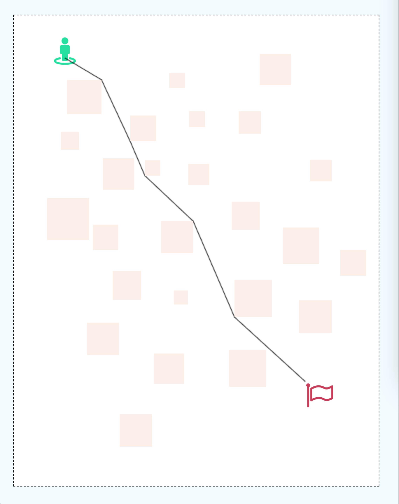

# 寻找最短路径

鹅厂大神安正超发的面试题，就把它当做自己GitHub第一项目慢慢完善吧哈哈，按要求：

* 地图可设置大小，跟使用类似截图的方式来设置，如图虚线范围；
* 障碍物可设置大小，咳咳，这个我比较懒 ( -᷅_-᷄ ) 设置为随机大小。双击一下添加一个障碍物，位置为双击点，目前不支持叠加；
* 地点和终点位置可以设置，通过单击方式；

参考文章：

 >https://wenku.baidu.com/view/2dcfa4d3b9f3f90f76c61bd0.html
 >
 >http://www.doc88.com/p-0806921401437.html

